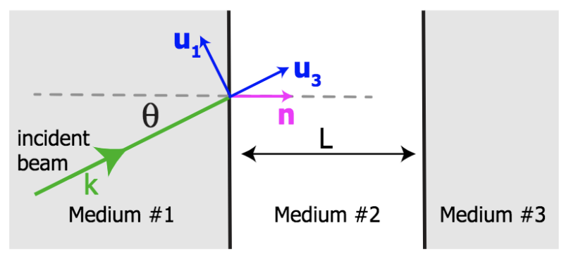

# Centroid Shifts of Reflected Light with Angular Momentum

This code calculates the intensity centroid shifts of Laguerre-Gaussian beams
with angular momentum incident on a reflective medium. The **background** folder
holds relevent theory for the underlying calculations and explores the
relationships between different froms of angular momentum.

